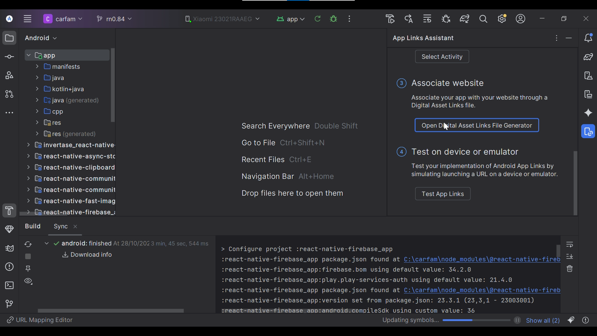
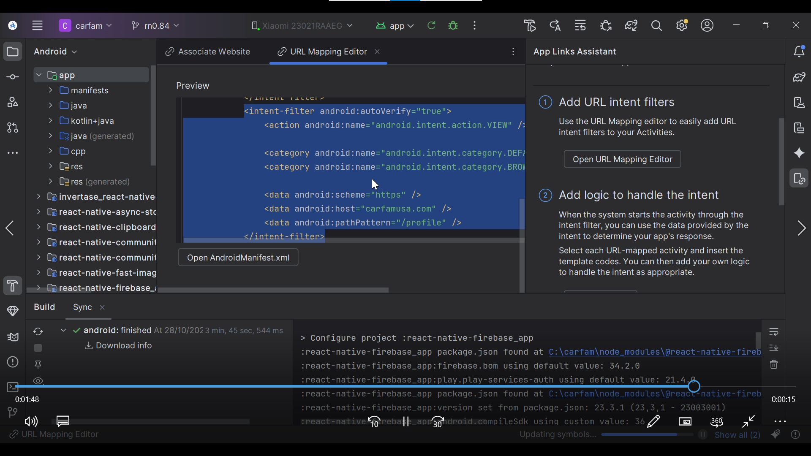

# 🔗 Deep Linking, Universal Links & App Links in React Native (No Firebase)

A complete guide + working example for implementing **deep linking, universal links, and app links** in a React Native app using a **Node.js backend**, without Firebase Dynamic Links.

Firebase Dynamic Links have become unreliable in recent updates — so this repo provides a **clean, stable, and professional alternative** that works on both **Android** and **iOS**.

---

## 🚀 Features
- ✅ Works across **Android and iOS**
- ⚙️ Uses a simple **Node.js + Express backend**
- 🌐 Hosted on **Vercel**
- 🔒 Supports verified domains via `assetlinks.json` and `apple-app-site-association`
- 💡 Easy integration into any existing React Native project

---

## 🧠 How It Works
1.[ A user clicks a link like this](https://car-fam-usa.vercel.app/)

2. The **backend (Node.js)** hosts the required JSON verification files for Android and iOS.
3. The OS verifies the link belongs to your app.
4. The **React Native app** intercepts the URL and navigates to the correct screen.


## 2.Backend Setup (Node.js)
 - Folder structure should be
  
  - get the vercel file from backend directory
- Create a minimal Express server:

<pre> ``` 
const express = require('express');
const path = require('path');

const app = express();
const PORT = process.env.PORT || 3000;

// Serve the required files for universal links
app.use('/.well-known', express.static(path.join(__dirname, '.well-known')));

// Serve apple-app-site-association
app.get("/.well-known/apple-app-site-association", (req, res) => { 
    res.sendFile(path.join(__dirname, ".well-known/apple-app-site-association")); 
});

// Serve assetlinks.json for Android
app.get("/.well-known/assetlinks.json", (req, res) => {
    res.sendFile(path.join(__dirname, ".well-known/assetlinks.json"));
});

// Handle ALL routes - redirect to app or store
app.get("*", (req, res) => {
    const userAgent = req.headers["user-agent"] || "";
    const isAndroid = /Android/.test(userAgent);
    const isIOS = /iPad|iPhone|iPod/.test(userAgent);

    // App deep link (change 'myapp' to your app scheme)
    const appDeepLink = "myapp://" + (req.path !== "/" ? req.path : "home");
    
    // Store URLs
    const playStoreUrl = "https://play.google.com/store/apps/details?id=com.appname";
    const appStoreUrl = "https://apps.apple.com/app/idXXXXXXXXX";

    // Simple HTML that tries to open app, then redirects to store
    const html = `
    <html>
        <head>
            <title>Redirecting to App</title>
        </head>
        <body>
            <script>
                // Try to open the app first
                window.location.href = "${appDeepLink}";
                
                // If app isn't installed, redirect to store after 1 second
                setTimeout(function() {
                    if (${isAndroid}) {
                        window.location.href = "${playStoreUrl}";
                    } else if (${isIOS}) {
                        window.location.href = "${appStoreUrl}";
                    } else {
                        window.location.href = "${playStoreUrl}"; // desktop fallback
                    }
                }, 1000);
            </script>
            <p>Opening app...</p>
        </body>
    </html>
    `;

    res.send(html);
});

app.listen(PORT, () => {
    console.log(`Server is running on http://localhost:${PORT}`);
});  ``` </pre>


## 3. Android Setup

Open android/app/src/main/AndroidManifest.xml
  or use Android Stuio App Links Assistant
  
  
  - Add Intent filters using app links assistant
  

  or you can visit official website [ link](https://reactnavigation.org/docs/deep-linking/)

 ### Linking Config on React Native Part
  - you can get the file from frontEnd directory (named: linkingConfig)


### iOS Setup

Open your react native project in xcode using 'xed ios' command in root project directory

- go to sign in & capabilites  and add your domain in associated domains (applinks:domainname.com)

- open AppDelegate.mm or .swift file(new architecture) and add RCT linking code 
visit this link to get the latest code [ link](https://reactnavigation.org/docs/deep-linking/) inside this page find 
  
   paste in the file

